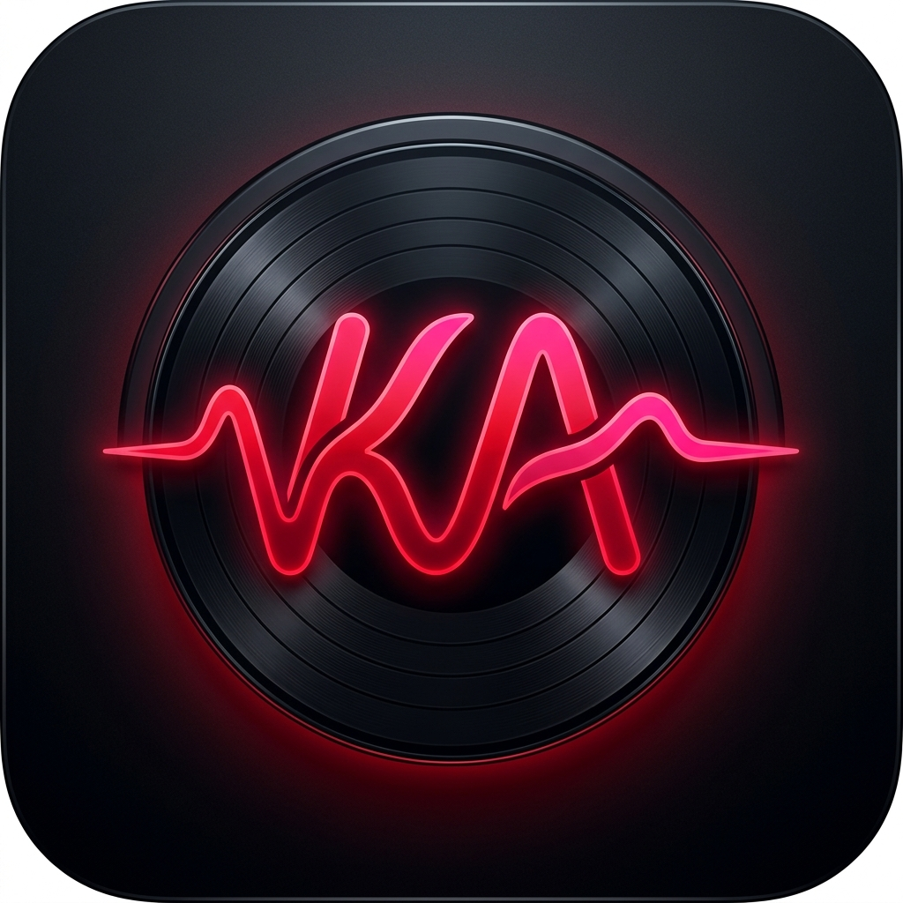

# 🎧 KuroakaiAudio (黒赤 Audio)
> **Bit-Perfect High-Res Audio Engine for Audiophiles**

<p align="center">
  
</p>

KuroakaiAudio is a cross-platform, high-fidelity music player built with a high-performance **C++ Core Audio Engine** (FFmpeg + miniaudio) and a modern **Flutter Frontend** for Windows and Android via `dart:ffi`.

---

## 📥 Downloads & Releases (Aplikasi PC & HP)

Unduh installer/binary aplikasi siap pakai untuk **Windows (PC)** dan **Android (HP)** dari halaman **GitHub Releases**:

[](https://github.com/DeruDJ22/audiophile/releases/latest)

| Platform | Format File | Link Download |
|---|---|---|
| 🪟 **Windows PC (x64)** | `.zip` (Executable + DLL) | [📦 Download Windows Zip](https://github.com/DeruDJ22/audiophile/releases/latest) |
| 🤖 **Android HP** | `.apk` (Release Build) | [📱 Download Android APK](https://github.com/DeruDJ22/audiophile/releases/latest) |

> *Catatan: Setiap kali tag versi baru (seperti `v1.0.0`) di-push ke GitHub, sistem CI/CD GitHub Actions akan otomatis mengompilasi dan mengunggah file `.zip` (PC) dan `.apk` (HP) ke halaman Releases.*

---

## 🏛️ Monorepo Architecture

```
audiophile/
├── cpp_core/                  # C++ Shared Engine Library
│   ├── CMakeLists.txt         # Cross-platform build script (MSVC / NDK)
│   ├── include/
│   │   └── kuroakai_engine.h  # C API declarations (extern "C") for FFI
│   └── src/
│       └── kuroakai_engine.cpp# FFmpeg decoding & WASAPI/Oboe audio ring buffer
├── lib/                       # Flutter Application
│   ├── ffi/
│   │   └── kuroakai_bindings.dart # Dart FFI struct and function bindings
│   ├── services/
│   │   ├── file_picker_service.dart # Scoped storage & file picker
│   │   └── app_link_service.dart    # OS Intent / CLI file associations
│   └── main.dart              # Dark-mode Audiophile UI
├── android/                   # Android App Configuration
│   └── app/src/main/AndroidManifest.xml # "Open With..." audio/* intent filters
├── windows/                   # Windows Integration
│   ├── register_file_associations.reg # Registry keys for .flac, .dsf, .mp3
│   └── file_association_guide.md
├── assets/
│   ├── logo.png               # Application icon
│   └── logo.svg               # Scalable vector logo
└── .github/workflows/
    └── build.yml              # Automated GitHub Actions workflow for Win & Android Releases
```

---

## 🚀 Key Technical Highlights

1. **Bit-Perfect Audio Output**: Uses `miniaudio` configured for **WASAPI Exclusive Mode** on Windows and **Oboe / AAudio Low Latency** on Android.
2. **Universal Format Decoding**: Powered by FFmpeg (`libavcodec`, `libavformat`, `libswresample`) supporting FLAC, DSD (`.dsf`, `.dff`), MP3, WAV, AAC, ALAC, and AIFF up to 384kHz / 32-bit.
3. **Accurate Bit Depth Detection**: Automatic source format analysis (8/16/24/32/64-bit) via `AVSampleFormat` mapping.
4. **Android Scoped Storage Compliance**: Uses `file_picker` and `permission_handler` to query `READ_MEDIA_AUDIO` on Android 13+ without needing full disk access permissions.
5. **OS Integration ("Open With...")**: Full file association setup for Android Intent Filters (`audio/*`) and Windows Registry (`HKCU\Software\Classes`).
6. **Automated CI/CD**: Matrix build workflow compiling the native C++ library (`.dll` / `.so`) and packaging Flutter releases whenever a tag (`v*`) is pushed.

---

## 🛠️ Quick Start & Local Compilation

### Prerequisites

- **Flutter SDK** ≥ 3.10.0
- **CMake** ≥ 3.18
- **FFmpeg** development libraries (avcodec, avformat, swresample, avutil)
- **miniaudio** header-only library (`miniaudio.h`)
- **Visual Studio** with C++ workload (Windows) or **Android NDK r25c** (Android)

### 1. Compile C++ Core Engine
```bash
cd cpp_core
cmake -B build -DCMAKE_BUILD_TYPE=Release
cmake --build build --config Release
```

### 2. Run Flutter App
```bash
flutter pub get
flutter run -d windows
# or for android:
flutter run -d android
```

---

## 🏷️ Triggering Release Build

Push a version tag to trigger GitHub Actions automated compilation and GitHub Release publication:

```bash
git tag -a v1.0.0 -m "Initial KuroakaiAudio Bit-Perfect Release"
git push origin v1.0.0
```

---

## 📄 License

Copyright © 2026 KuroakaiAudio. All rights reserved.
